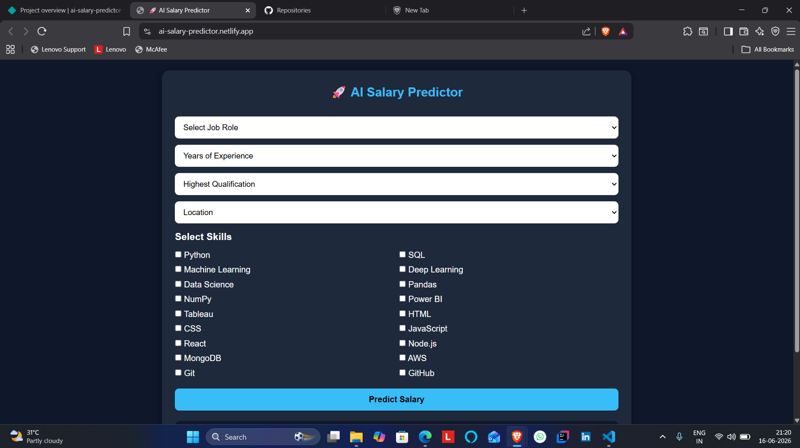
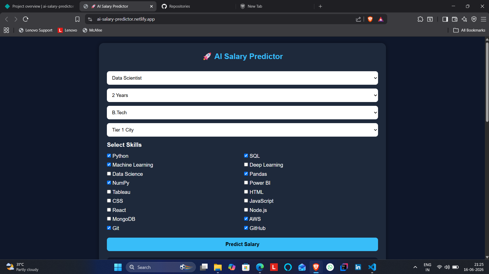
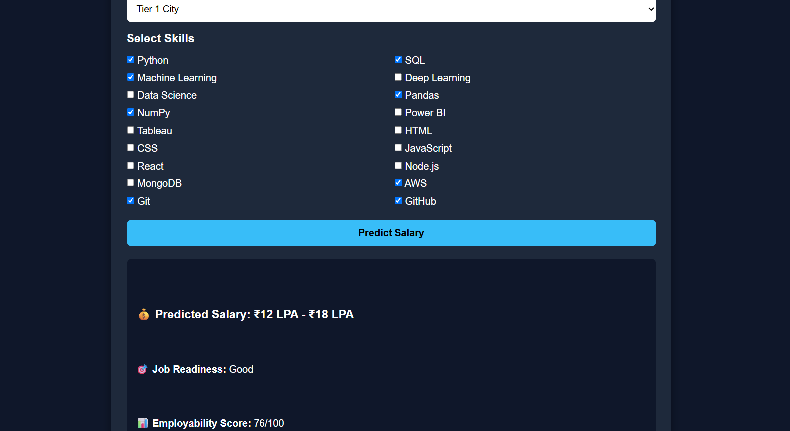
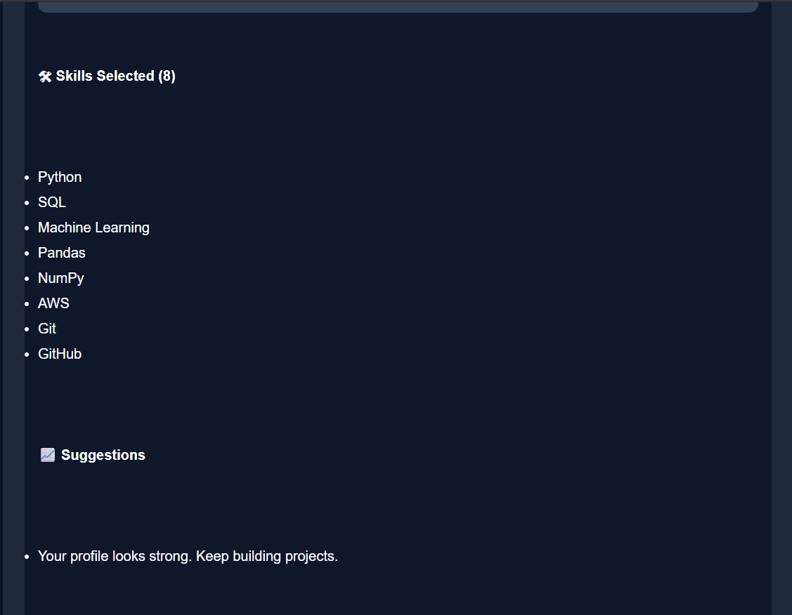

# AI Salary Predictor

🚀 Day 8 of my 30 Days 30 AI Websites Challenge

AI Salary Predictor is a web application that estimates salary ranges based on a user's skills, education, experience, and location.

---

## 🌐 Live Demo

Demo Link:

https://ai-salary-predictor.netlify.app/

---

## 📸 Screenshots

---

## ✨ Features

✅ Salary Range Prediction

✅ Employability Score Calculation

✅ Job Readiness Analysis

✅ Skills-Based Evaluation

✅ Personalized Suggestions

✅ Interactive Progress Bar

✅ Responsive UI

---

## 🛠 Technologies Used

- HTML
- CSS
- JavaScript
- AI-Assisted Development

---

## 📋 How It Works

1. Select Job Role
2. Select Experience Level
3. Select Education Qualification
4. Select Location
5. Choose Your Skills
6. Click Predict Salary

The application generates:

- Predicted Salary Range
- Employability Score
- Job Readiness Rating
- Skills Overview
- Improvement Suggestions

---

## 🎯 Example

### Input

Role:
Data Scientist

Experience:
2 Years

Degree:
B.Tech

Location:
Tier 1 City

Skills:
Python, SQL, Pandas, NumPy, Machine Learning, Git, GitHub

### Output

💰 Predicted Salary:
₹8 LPA - ₹12 LPA

📊 Employability Score:
75/100

🎯 Job Readiness:
Good

📈 Suggestions:
- Learn AWS
- Build More Real-World Projects

---

## 🚀 Challenge Progress

Day 1 ✅ AI Resume Analyzer

Day 2 ✅ AI Career Roadmap Generator

Day 3 ✅ AI Project Idea Generator

Day 4 ✅ AI Skill Gap Analyzer

Day 5 ✅ AI Interview Question Generator

Day 6 ✅ AI Portfolio Review Analyzer

Day 7 ✅ AI LinkedIn Post Generator

Day 8 ✅ AI Salary Predictor

---

## 👨‍💻 Author

Anand,

B.Tech CSE(Data Science)

30 Days • 30 AI Websites Challenge
